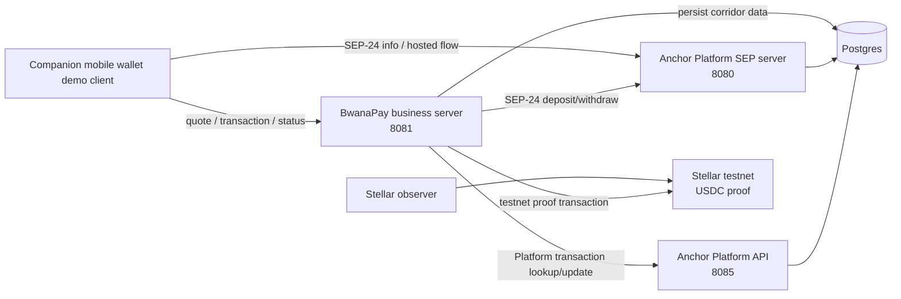

# BwanaPay Anchor Platform Corridor Demo

BwanaPay is a corridor-first payments prototype for Southern Africa, starting
with the Zambia-Malawi corridor. This repository contains the local Anchor
Platform stack and BwanaPay business server used by the current demo.

The current branch demonstrates a controlled Stellar testnet prototype, not a
live production service.

## Reviewer Links

- Recorded demo video: https://youtu.be/YKCVPRTT658
- Technical architecture document: https://drive.google.com/file/d/1Ol0lmVS17ccfu3WRaNLOljFB9iV1Dxtk/view?usp=sharing
- Project website: https://bwanapay.com

## Current Demo State

The demo proves these working pieces:

- Stellar Anchor Platform 4.3.0 running locally with SEP server, Platform server,
  Stellar observer, and Postgres.
- SEP-1 service discovery, SEP-10 authentication, and SEP-24 hosted deposit and
  withdrawal flow validation.
- BwanaPay business server on port `8081`.
- Guarded demo endpoints using `X-BwanaPay-Demo-Key`.
- Corridor quote, transaction creation, transaction lookup, and persisted status
  handling.
- Zambia to Malawi and Malawi to Zambia corridor directions in controlled
  testnet/demo form.
- Testnet USDC proof transaction generation and explorer link handling.
- Mobile wallet integration through a companion Expo/React Native demo client.

The demo app uses these user-facing screens:

- Home: `Send to Malawi`, `Request from Malawi`, `Transfer Status`, recent
  activity, `Add Money`, `Cash Out`, and `Testnet Proof`.
- Send: corridor transfer flow, recipient management, and local send placeholder.
- Activity: transaction history and testnet proof coverage.
- Side menu: `Testnet Status`, theme toggle, and reset.

## Not Part of This Demo Branch

The following are intentionally not claimed as complete in this branch:

- Production KYC/AML completion.
- Production fiat collection.
- Production payout execution.
- Production liquidity operations.
- Mainnet corridor operation.
- ZMW or MWK token issuance.
- Completed production SEP-31 deployment.
- Third-party KYC provider integration.

KYC/AML, fiat collection, payout integrations, and liquidity operations remain
compliance-gated and partner-dependent roadmap items.

## Architecture Summary

Local services:

| Service | Port | Purpose |
| --- | ---: | --- |
| `sep-server` | `8080` | Anchor Platform SEP server, SEP-1/SEP-10/SEP-24 |
| `platform-server` | `8085` | Anchor Platform API |
| `stellar-observer` | internal | Watches testnet payment activity |
| `db` | `5432` | Postgres persistence |
| `business-server` | `8081` | BwanaPay demo API and corridor orchestration |

The mobile app calls the business server for corridor flows and the SEP server
for Anchor Platform discovery/SEP-24 availability.

For Android Emulator demos, public URLs are configured with `10.0.2.2`, which is
the emulator bridge to the host machine. Host-side terminal commands should use
`localhost`.



## Reviewer Quick Verification

These checks are intended to help reviewers confirm the backend and Anchor stack
without needing the mobile client source.

```powershell
# 1. Static syntax check
npm run check

# 2. Start the local stack
docker-compose up -d --build

# 3. Confirm containers
docker-compose ps

# 4. Check business server health
Invoke-RestMethod http://localhost:8081/health

# 5. Check Testnet Status backend data
Invoke-RestMethod `
  -Method Get `
  -Uri http://localhost:8081/demo-readiness `
  -Headers @{ 'X-BwanaPay-Demo-Key' = '<YOUR_DEMO_API_KEY>' }

# 6. Check SEP-24 availability
Invoke-RestMethod http://localhost:8080/sep24/info

# 7. Create a quote for the Zambia to Malawi corridor
$body = @{
  fromCurrency = 'ZMW'
  toCurrency = 'MWK'
  amount = 100
} | ConvertTo-Json

Invoke-RestMethod `
  -Method Post `
  -Uri http://localhost:8081/corridor/quote `
  -Headers @{ 'X-BwanaPay-Demo-Key' = '<YOUR_DEMO_API_KEY>' } `
  -ContentType 'application/json' `
  -Body $body
```

## Setup

1. Copy and edit environment configuration:

```powershell
cd path\to\bp-anchor
Copy-Item dev.env.example dev.env
```

2. Fill in local testnet/demo secrets in `dev.env`.

Use:

- `10.0.2.2` for emulator-facing public URLs.
- Your PC LAN IP for a physical Android device on the same Wi-Fi/hotspot.
- `localhost` for host-side PowerShell checks.

3. Start the stack:

```powershell
docker-compose up -d --build
```

4. Confirm services are running:

```powershell
docker-compose ps
```

## Health And Readiness Checks

Business server health:

```powershell
Invoke-RestMethod http://localhost:8081/health
```

Testnet Status backend proof:

```powershell
Invoke-RestMethod `
  -Method Get `
  -Uri http://localhost:8081/demo-readiness `
  -Headers @{ 'X-BwanaPay-Demo-Key' = '<YOUR_DEMO_API_KEY>' }
```

SEP-24 info:

```powershell
Invoke-RestMethod http://localhost:8080/sep24/info
```

## Demo API Endpoints

All guarded demo endpoints require:

```text
X-BwanaPay-Demo-Key: <YOUR_DEMO_API_KEY>
```

Set `DEMO_API_KEY` in `dev.env` and send the same value using the
`X-BwanaPay-Demo-Key` header when calling guarded demo endpoints.

| Method | Path | Purpose |
| --- | --- | --- |
| `GET` | `/health` | Business server health |
| `GET` | `/demo-readiness` | Testnet Status data for app/readiness checks |
| `POST` | `/demo-transaction` | Create Anchor-backed demo deposit |
| `POST` | `/demo-withdrawal` | Create Anchor-backed demo withdrawal |
| `GET` | `/platform-transaction/:id` | Inspect Anchor Platform transaction |
| `POST` | `/corridor/quote` | Create corridor quote |
| `POST` | `/corridor/transaction` | Create persisted corridor transaction |
| `GET` | `/corridor/transaction/:id` | Fetch corridor transaction status/proof |

Example corridor quote:

```powershell
$body = @{
  fromCurrency = 'ZMW'
  toCurrency = 'MWK'
  amount = 100
} | ConvertTo-Json

Invoke-RestMethod `
  -Method Post `
  -Uri http://localhost:8081/corridor/quote `
  -Headers @{ 'X-BwanaPay-Demo-Key' = '<YOUR_DEMO_API_KEY>' } `
  -ContentType 'application/json' `
  -Body $body
```

## Example API Responses

Trimmed example response from `POST /corridor/quote`:

```json
{
  "success": true,
  "quote": {
    "id": "bp-quote-...",
    "fromCountry": "ZM",
    "toCountry": "MW",
    "fromCurrency": "ZMW",
    "toCurrency": "MWK",
    "sendAmount": 100,
    "fee": 2,
    "recipientAmount": 6370,
    "exchangeRate": 65,
    "estimatedDelivery": "Testnet demo"
  }
}
```

Trimmed example response from `GET /demo-readiness`:

```json
{
  "ok": true,
  "network_passphrase": "Test SDF Network ; September 2015",
  "checks": {
    "business_server": { "ok": true },
    "demo_auth": { "ok": true, "mode": "api_key" },
    "persistence": { "ok": true },
    "sep24_info": { "ok": true },
    "platform_api": { "ok": true },
    "stellar_testnet": { "ok": true },
    "proof_asset": { "ok": true, "asset": "stellar:USDC:..." }
  }
}
```

Trimmed example corridor transaction fields:

```json
{
  "success": true,
  "transaction": {
    "id": "bp-corridor-...",
    "status": "pending_user_transfer_start",
    "corridor": "ZM-MW",
    "fromCurrency": "ZMW",
    "toCurrency": "MWK",
    "anchorTransactionId": "...",
    "stellarProofStatus": "confirmed",
    "stellarProof": {
      "hash": "...",
      "ledger": 123456,
      "network_passphrase": "Test SDF Network ; September 2015"
    }
  }
}
```

## Proof Script

The helper script creates a measurable Anchor-backed deposit and prints the
Platform transaction ID, status, hosted SEP-24 URL, and Stellar testnet proof.

```powershell
cd path\to\bp-anchor
.\scripts\demo-flow.ps1 `
  -BusinessServerUrl http://localhost:8081 `
  -DemoApiKey '<YOUR_DEMO_API_KEY>' `
  -Amount 25 `
  -OpenExplorer
```

## Mobile Wallet

The recorded demo uses a companion Expo/React Native wallet client that calls
this Anchor/business-server stack. This repository is focused on the Anchor
Platform and backend integration layer; the mobile client is shown in the demo
video as the user-facing interface.

The companion mobile wallet source is maintained separately; this repository is
intended to document and verify the Anchor Platform and business-server
integration layer used by the recorded demo.

For Android Emulator demos, the wallet client points at the host machine through
`10.0.2.2`:

```text
EXPO_PUBLIC_ANCHOR_BASE_URL=http://10.0.2.2:8080
EXPO_PUBLIC_BUSINESS_SERVER_URL=http://10.0.2.2:8081
EXPO_PUBLIC_STELLAR_NETWORK_PASSPHRASE=Test SDF Network ; September 2015
EXPO_PUBLIC_DEMO_API_KEY=<YOUR_DEMO_API_KEY>
```

## Demo Narrative

Recorded demo flow:

1. Start on BwanaPay Home.
2. Briefly show `Send to Malawi`, `Request from Malawi`, and `Transfer Status`.
3. Open side-menu `Testnet Status` for readiness proof.
4. Create a `Send to Malawi` transaction.
5. Show `Transfer Status` with transaction lifecycle and testnet USDC proof.
6. Close with the production boundary: KYC/AML, fiat collection, payout
   integrations, and liquidity remain compliance-gated and partner-dependent.

## License

Prototype/demo code for BwanaPay technical validation.
